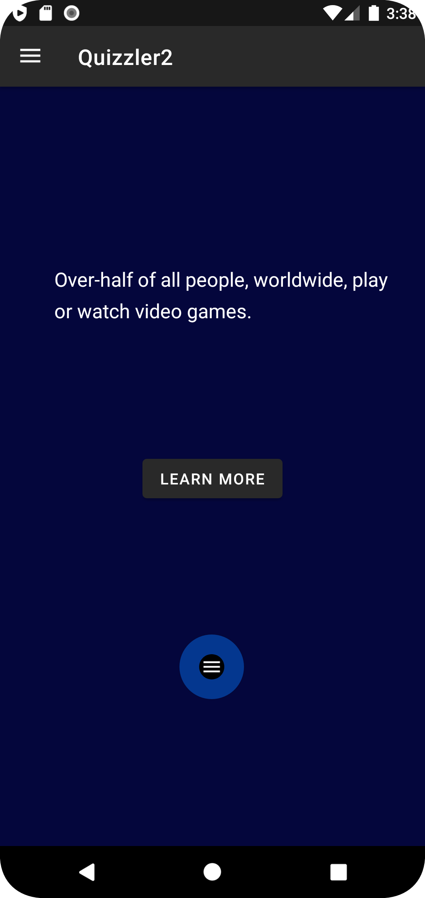
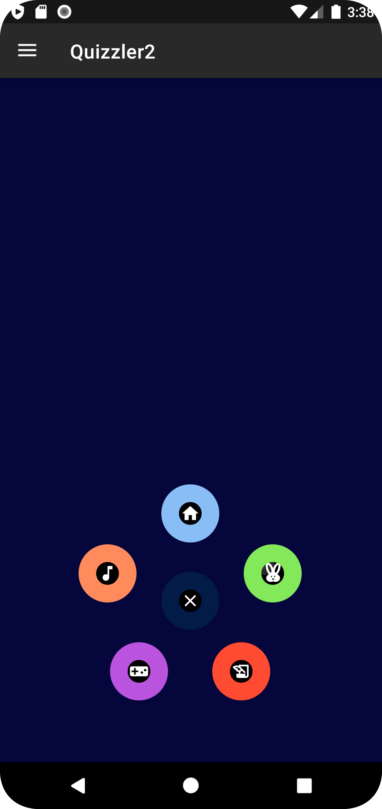
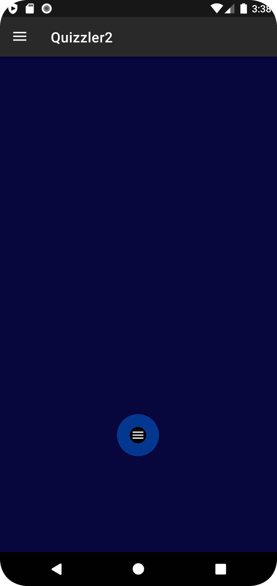
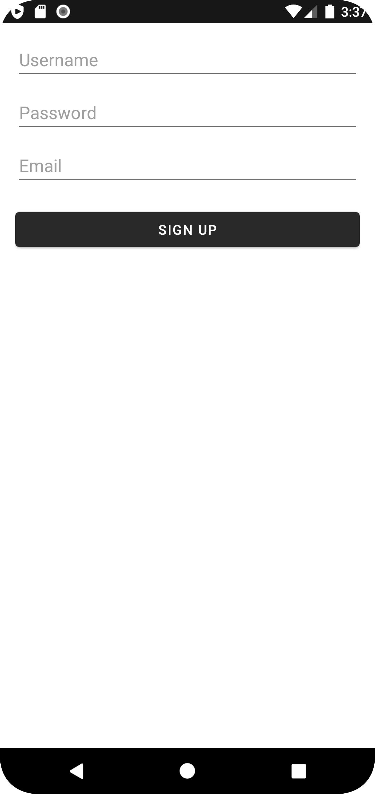
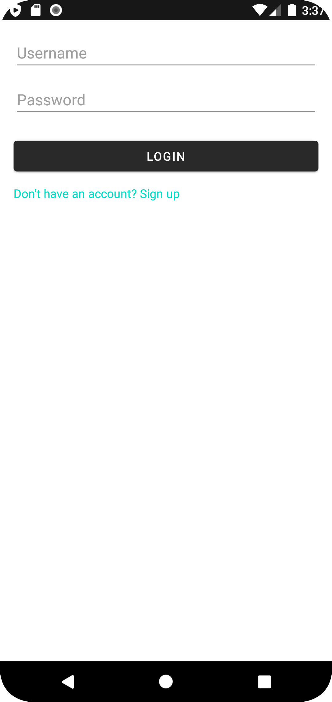
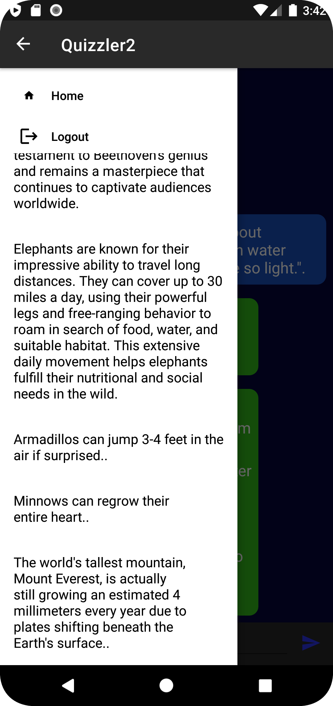

# Quizzler2 Android App

Welcome to Quizzler2! This Android app is designed to provide users with an interactive learning experience where they can ask questions and receive answers related to various topics. The app integrates with a chatbot to facilitate conversations and information exchange.

## Features

- Users can explore different topics and initiate conversations with a chatbot to learn more about those topics.
- The app supports real-time messaging where users can send questions and receive responses from the chatbot.
- Conversations are categorized based on topics, allowing users to keep track of their learning interests.
- The app offers a "Learn More" button that creates a new conversation and opens the chat interface for further learning.

## Technologies Used

- Android Studio: The app is developed using Android Studio, the official integrated development environment (IDE) for Android app development.
- Java: The primary programming language used for developing Android apps.
- AWS Amplify: The app utilizes AWS Amplify, a framework for building scalable and secure cloud-powered applications. It integrates with AWS services for authentication, storage, and more.
- GraphQL: The app communicates with the backend using GraphQL queries and mutations, enabling efficient data exchange.
- RecyclerView: The app employs the RecyclerView widget to efficiently display lists of messages in the chat interface.
- Fragments: The app uses fragments to create modular and reusable UI components, facilitating navigation and user interaction.
- Material Design: The app follows the Material Design guidelines to provide a modern and visually appealing user interface.

## Getting Started

To run Quizzler2 on your local machine, follow these steps:

1. Clone this repository to your local machine.
2. Open the project in Android Studio.
3. Build and run the app on an Android emulator or a physical device.

## Testing 

1. Open the project in Android Studio.
2. Navigate to the app/src/test directory to access unit tests.
3. Navigate to the app/src/androidTest directory to access UI tests.
4. Right-click on a test file or package and select "Run" to execute the tests.

## Usage

1. Launch the app and explore the available topics.
2. Select a topic of interest and initiate a conversation with the chatbot.
3. Send messages and receive responses in real-time.
4. Use the "Learn More" button to create new conversations and learn about different topics.

## Screenshots

## Contributing

Contributions to Quizzler2 are welcome! If you find any issues or have suggestions for improvements, please open an issue or submit a pull request.

## License

This project is licensed under the [MIT License](LICENSE).

---
